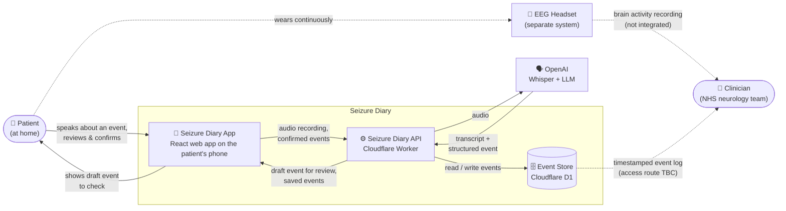

# Seizure Diary: System Diagram (Level 0)

A zoomed-out view of the whole system. Seizure Diary is shown as one box, along with the people and external systems it talks to.

## Key

| Element | Description |
| --- | --- |
| **Patient** | Wears the EEG headset at home. Uses the app to log events: possible seizures, waking up, going to sleep and anything else. They may be mid-seizure while using it, so the UI must be extremely simple. |
| **Seizure Diary App** | React + TypeScript + Vite front end, styled with Tailwind / shadcn/ui and using Lucide icons. It records audio, shows the draft event for review and saves it on confirmation. |
| **Seizure Diary API** | Cloudflare Worker. It receives the audio, sends it for transcription and extraction, and stores confirmed events. |
| **Event Store** | Cloudflare D1 (SQLite). Holds timestamped events. |
| **OpenAI** | Whisper turns speech into a transcript. A cheaper LLM then turns that into a structured event (type, time, notes), which the API validates with Zod. |
| **EEG Headset** | Records brain activity continuously. It is a separate system with no direct integration. |
| **Clinician** | Reads the EEG alongside the event log, matching them up by timestamp. |

Solid lines are in scope for this spike. Dotted lines are context: they show how the data gets used but aren't built here.

## Core flow

1. Patient opens the app and taps **Record an event**.
2. Patient speaks, then taps **Stop recording**.
3. App sends the audio to the API. The API gets a transcript and a structured draft event back from the speech-to-text service.
4. App shows the draft. The patient checks it, corrects it if needed and confirms.
5. API saves the confirmed event to D1.

## Open questions

- **Clinician access:** how does the event log reach the clinical team (export, dashboard, sent with the EEG data)?
- **Patient identity:** how is an event tied to a patient and their EEG session (e.g. a session code given out with the headset)?
- **Timestamps:** should an event use the time it was recorded, or a time the patient states ("about 10 minutes ago")? This matters for matching events against the EEG.
